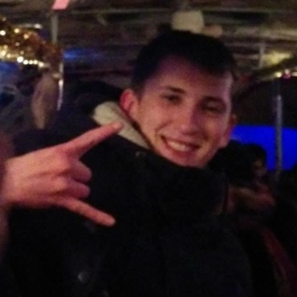

# Serhii Samus

***
## My Contact Info:
* **Phone:** +380975662350
* **E-mail:** cergi8273@gmail.com
* **GitHub:** [zero8273](https://github.com/zero8273)
* **Discord:** Serheii Samus (@zero8273)
***
## About Me
I am 27 years old. I live and work in Kyiv. My job is an engineer-technologist. I work in one company for 5 years without any growth or self-improvement. Now I want to study a new profession that evolved all the time. It motivate me to learn something new and improve my skills. I want to become a front-end developer
* **My strengths:**
  * Learnability
  * Communicative
  * Organization
  * Team playing
  * Purposefulness
***
## Skills 
 * HTML
 * CSS
 * JavaScript
 * Git/GitHub
 * Figma, Adobe Photoshop
***
## Code Example
```
function areaLargestSquare(r) {
  let S = 2 * Math.pow(r, 2)
  return S; 
}
```
***
## Education
* **Kyiv Polytechnic Institute** 
  * instrumentation faculty
* **Code Basics** 
  * HTML
  * CSS
* **Hexlet** 
  * Git/GitHub
  * Console
***
## Languages
* **Ukrainian** - native speaker
* **English** - B2